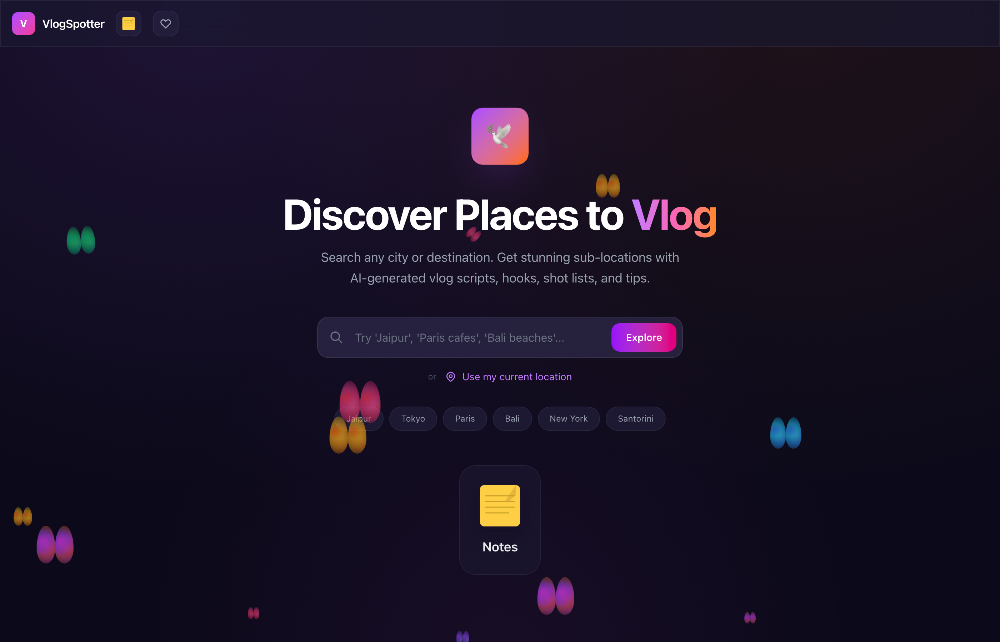

# VlogSpotter

**AI-powered travel vlogging companion** — Discover places to vlog near you, get creative reel scripts, build smart itineraries, and plan your content on the go.

> **Live demo:** [vlog-explorer.vercel.app](https://vlog-explorer.vercel.app)



---

## Features

### Core
- **Nearby Place Discovery** — Auto-detects your location and suggests 5 nearby vlog-worthy spots using GPT-4o mini
- **Search by Name** — Type any city or landmark to get place suggestions
- **Pinterest-style Grid** — Masonry layout with real photos from Pexels, Wikipedia, and Wikimedia Commons
- **Vlog Idea Cards** — Each sub-place comes with:
  - Quirky opening hooks (scroll-stopping one-liners)
  - Full 30-second Instagram reel scripts (timed: hook → tease → reveal → payoff → CTA)
  - Shot tips and filming angles
  - Best times to visit
- **"Suggest More" Button** — Load additional places without re-searching

### Tools
- **Save / Bookmark** — Persist favorite places in localStorage
- **Smart Itinerary Builder** — Auto-arranges saved places into an optimized day-wise route with travel time estimates (Haversine + nearest-neighbor algorithm)
- **Open in Google Maps** — One-tap navigation to any place or full itinerary route
- **Interactive Map View** — Toggle a Leaflet map showing all suggested places relative to your location
- **Notes** — Apple Notes-style editor with create, edit, delete — saved locally

### UX
- **Feature Tour** — First-time spotlight tooltips for new features (with "Skip all" option)
- **Animated Butterfly Background** — Colorful, multi-sized butterflies floating across the page
- **Back Navigation** — Return to search results without losing progress
- **Fully Responsive** — Works on mobile, tablet, and desktop

---

## Tech Stack

| Layer | Technology |
|-------|-----------|
| Framework | [Next.js 16](https://nextjs.org/) (App Router) |
| Styling | [Tailwind CSS v4](https://tailwindcss.com/) |
| AI | [OpenAI GPT-4o mini](https://platform.openai.com/) |
| Images | [Pexels API](https://www.pexels.com/api/) + Wikipedia + Wikimedia Commons |
| Maps | [Leaflet](https://leafletjs.com/) + [react-leaflet](https://react-leaflet.js.org/) |
| Location | Browser Geolocation API |
| Persistence | localStorage |
| Hosting | [Vercel](https://vercel.com/) |

---

## Getting Started

### Prerequisites

- Node.js 18+
- An [OpenAI API key](https://platform.openai.com/api-keys)
- (Optional) A [Pexels API key](https://www.pexels.com/api/) for higher-quality images

### Installation

```bash
git clone https://github.com/namanjaswani27/vlog-explorer.git
cd vlog-explorer
npm install
```

### Environment Variables

Copy the example file and fill in your keys:

```bash
cp .env.example .env.local
```

```
OPENAI_API_KEY=sk-your-key-here
PEXELS_API_KEY=your-pexels-key-here
```

### Run Locally

```bash
npm run dev
```

Open [http://localhost:3000](http://localhost:3000) in your browser.

### Build for Production

```bash
npm run build
npm start
```

---

## Project Structure

```
vlog-explorer/
├── public/                          # Static assets
├── src/
│   └── app/
│       ├── api/
│       │   ├── suggest/route.js     # OpenAI GPT-4o mini — place suggestions & vlog content
│       │   └── images/route.js      # Image fetching (Pexels → Wikipedia → Wikimedia)
│       ├── components/
│       │   ├── ButterflyBackground.js  # Animated butterfly overlay
│       │   ├── FeatureTip.js           # First-time feature spotlight system
│       │   ├── ItineraryModal.js       # Smart itinerary builder
│       │   ├── MapView.js              # Leaflet interactive map
│       │   ├── NotesIcon.js            # Apple Notes-style SVG icon
│       │   └── NotesModal.js           # Notes editor (CRUD + localStorage)
│       ├── globals.css              # Tailwind + custom animations
│       ├── layout.js                # Root layout & metadata
│       └── page.js                  # Main app (search, grid, modals, state)
├── .env.example                     # Required environment variables
├── .gitignore
├── package.json
└── README.md
```

---

## Deploy to Vercel

1. Push to GitHub
2. Import the repo at [vercel.com/new](https://vercel.com/new)
3. Add environment variables (`OPENAI_API_KEY`, `PEXELS_API_KEY`) in the Vercel dashboard
4. Deploy

---

## How It Works

1. **Location** — The app requests browser geolocation (or accepts a text search)
2. **AI Suggestions** — Coordinates/query are sent to the `/api/suggest` route, which calls GPT-4o mini with a creative prompt
3. **Image Enrichment** — For each sub-place, `/api/images` searches Pexels first, then falls back to Wikipedia and Wikimedia Commons
4. **Content Display** — Results render in a Pinterest-style masonry grid; clicking a card opens a detail modal with full vlog scripts, hooks, and tips
5. **Saving & Itinerary** — Saved places persist in localStorage; the itinerary builder uses the Haversine formula and nearest-neighbor algorithm to optimize routes

---

## License

MIT
